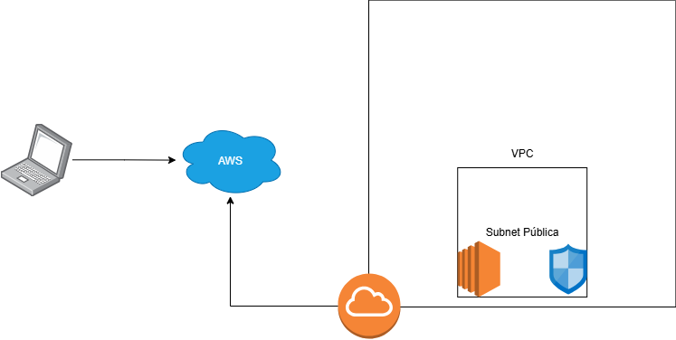

# Infraestrutura AWS com EC2

Este projeto apresenta um **diagrama de infraestrutura na AWS** criado no **draw.io (diagrams.net)**.

  
  

## Diagrama: 📊

## Componentes Utilizados: 🛠️
- **Usuário (Cliente):** Origem das requisições para a aplicação.  
- **Internet:** Representa a rede pública que conecta os usuários à AWS.  
- **Internet Gateway (IGW):** Permite a comunicação entre a VPC e a Internet.  
- **VPC (Virtual Private Cloud):** Rede isolada dentro da AWS onde os recursos foram provisionados.  
- **Subnet Pública:** Sub-rede dentro da VPC que contém recursos acessíveis pela Internet.  
- **EC2 Instance:** Máquina virtual onde a aplicação pode ser hospedada.  
- **Security Group:** Firewall virtual que controla as regras de entrada e saída da instância EC2.  

## Fluxo de Comunicação: 🔗
1. O **usuário** acessa a aplicação pela **Internet**.  
2. O tráfego passa pelo **Internet Gateway (IGW)**.  
3. Dentro da **VPC**, a requisição chega até a **Subnet Pública**.  
4. A **EC2** processa a requisição, respeitando as regras definidas no **Security Group**.  

---

Esse é um diagrama **básico**, que pode ser expandido futuramente.
